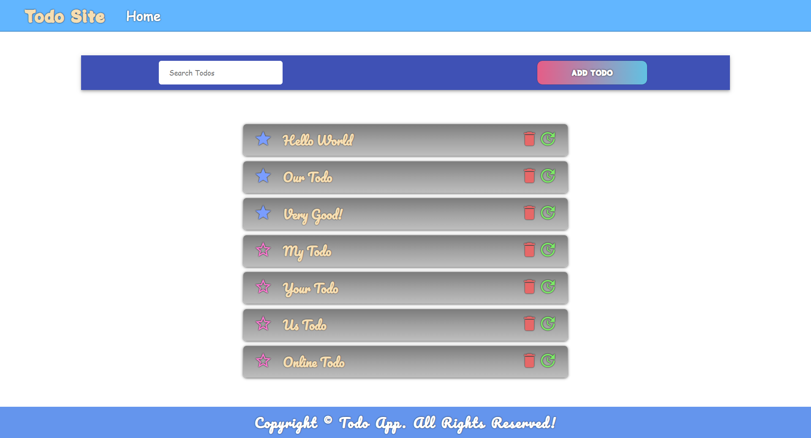

# 👨‍💻 JAMStack Todo Site.
## 📽 A project based on Panacloud React Bootcamp [Project 12C].

### ⚒ Project Demo:
####  For Project Demo Follow the Link For: 
#### Taskbox Site: https://todo-jamstack.netlify.app/

### 🕵️‍♂️ Project Details:
####  This project is based on primarily on Gatsby, TypeScript as well as uses other libraries too. In this app, you can use Create Todos!

### ⚙ Technical Details:
#### In this project, Gatsby, FaunaDB, GraphQL with TypeScript is used for the project.

### 🤹‍♂️ Skill:
&nbsp;&nbsp;&nbsp;&nbsp;
&nbsp;&nbsp;&nbsp;&nbsp;
&nbsp;&nbsp;&nbsp;&nbsp;
&nbsp;&nbsp;&nbsp;&nbsp;
&nbsp;&nbsp;&nbsp;&nbsp;
&nbsp;&nbsp;&nbsp;&nbsp;
&nbsp;&nbsp;&nbsp;&nbsp;
&nbsp;&nbsp;&nbsp;&nbsp;

### ✔ Contributers:

  <a href="https://github.com/faraasat">
    &nbsp&nbsp&nbsp&nbsp&nbsp&nbsp&nbsp&nbsp&nbsp&nbsp&nbsp&nbsp
  </a>

### 📷 Project UI:

  <a href="https://todo-jamstack.netlify.app/">
    &nbsp&nbsp&nbsp&nbsp&nbsp&nbsp&nbsp&nbsp&nbsp&nbsp&nbsp&nbsp
  </a>

